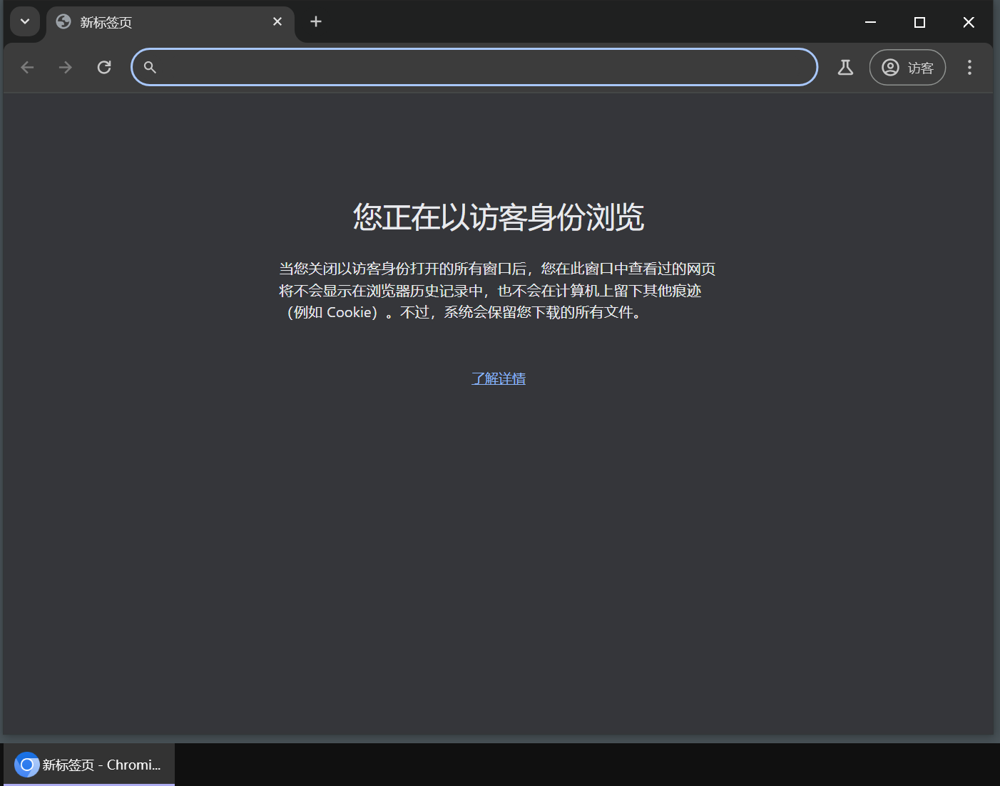
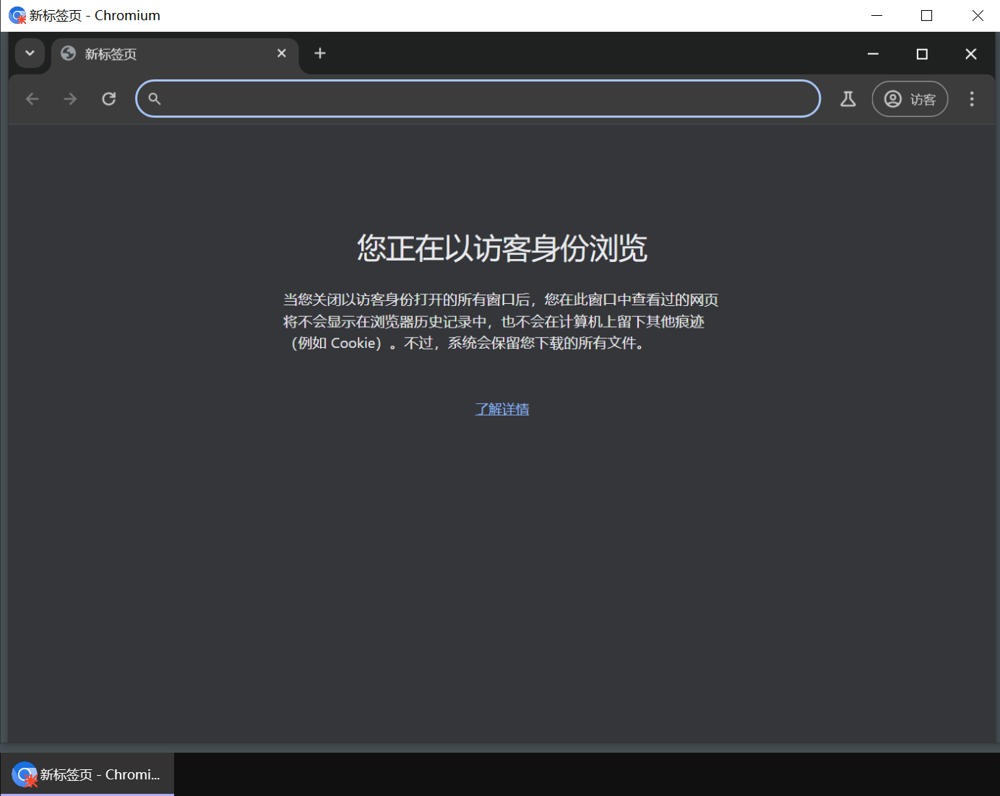
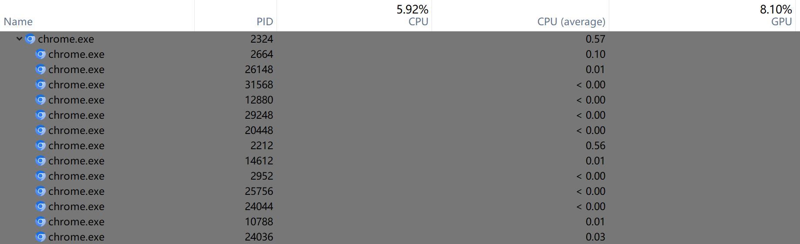

# 暂停进程GUI实现 - Suspend-Process-GUI 🚀

Windows下的进程冻结工具，通过创新的"替代窗口"交互方式，为您带来前所未有的流畅操作体验！

## ✨ 产品亮点

- **流畅操作逻辑** - 冻结时生成替代窗口，操作逻辑自然流畅
- **一键冻结/恢复** - 自定义快捷键，快速切换进程状态
- **子进程冻结处理** - 自动识别并冻结目标程序的所有子进程
- **高性能** - C#原生实现，性能优化好

## 🚀 快速开始

1. **下载安装**  
   [从Release页面](https://github.com/your-repo/releases) 下载最新版并解压到任意位置

2. **设置快捷键**  
   打开"暂停进程.exe"，配置您喜欢的快捷键组合

3. **开始使用**  
   将鼠标悬停在目标窗口上，按下快捷键即可冻结程序；双击窗口以解冻

## 🖼️ 使用示例
  
*冻结前：正常窗口*

  
*冻结后：生成外观相同的替代窗口*

  
*自动冻结子进程，完全杜绝后台CPU占用*

## ❓ 常见问题

**Q：遇到无法恢复的程序怎么办？**  
A：建议使用[System Informer](https://github.com/winsiderss/systeminformer)等专业工具手动恢复或终止进程

**Q：部分程序图标无法提取？**  
A：已知问题，作者暂时解决不了，不过这样的程序很少（目前发现的只有[Project-Graph](https://github.com/LiRenTech/project-graph)无法正常提取）

## 🌱 参与贡献

本人并非专业C#开发者，能力有限，本项目大部分代码通过AI辅助完成

欢迎有兴趣的开发者fork并继续完善。如有功能扩展，请通过issue告知，我会在README中标注并引流至你的仓库

以下是想实现但暂时无法实现的功能：

- [ ] 自动冻结程序名单：后台超过一定时间自动冻结，切换到前台自动恢复
- [ ] 更完善的图标提取方案
- [ ] 自呼吸功能（参考[雪藏](https://github.com/superDMS/HsFreezer-Hidden-in-the-snow-)）

## 🙏 致谢

特别感谢 [onlyclxy](https://github.com/onlyclxy) 的开创性工作，正是他提出的"替代窗口"理念奠定了本项目的基础。作者在原始版本上进行了优化和改进，包括：

- 稳定性增强：修复恶性崩溃bug
- 性能优化：暂停逻辑调用原生C#代码，而非PsTools里的Pssuspend
- 子进程冻结处理
- 高分辨率适配